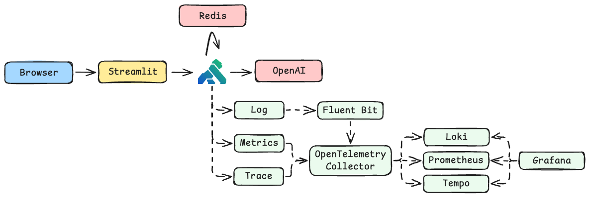

# Konbot - Kong Bot

This is a sample application that demonstrates Kong's AI-related plugins.

## Overview

The entire system architecture is as follows.



The directory structure is as follows.

```sh
.
├── app                  # Application source code
├── config
│   ├── fluent-bit       # Fluent Bit config
│   ├── grafana          # Grafana config
│   │   └── dashboards
│   │       └── default
│   ├── kong             # decK config
│   ├── loki             # Loki config
│   ├── otel-collector   # OpenTelemetry config
│   ├── prometheus       # Prometheus config
│   └── tempo            # Tempo config
└── sample-docs          # Sample document for RAG
```

## Plugins

You can use the following plugins.

| Plugin                   | Level    |
| ------------------------ | -------- |
| AI Proxy                 | basic    |
| AI Prompt Decorator      | basic    |
| AI RAG Injector          | basic    |
| AI AWS Guardrails        | advanced |
| AI Prompt Guard          | advanced |
| AI Semantic Cache        | advanced |
| AI Semantic Prompt Guard | advanced |
| AI Prompt Compressor     | advanced |

## How to run?(basic)

First, copy `.env.sample` to create `.env`.

```sh
cp .env.sample .env
```

Fill in your value.

```sh
#!!! This is a sample value!!!
# Required
DECK_OPENAI_API_KEY = "sk-proj-_..."
# Optional
DECK_GUARDRAILS_ID = "0sv..."
DECK_GUARDRAILS_VERSION = "1"
DECK_AWS_REGION = "ap-northeast-1"
DECK_AWS_ACCESS_KEY_ID = "AKI..."
DECK_AWS_SECRET_ACCESS_KEY = "zCv..."
```

Then, start up entire system.

```sh
docker compose up -d
```

After that, run the following scripts to set up vector store.

```sh
plugin_id=`curl http://localhost:8001/plugins | jq -r '.data[] | select(.name == "ai-rag-injector").id | @text'`
for file in sample-docs/*.json;
do
  echo -e "Ingesting $file..."
  curl --request POST \
    --url http://localhost:8001/ai-rag-injector/$plugin_id/ingest_chunk \
    --header 'content-type: application/json' \
    --data @$file
  echo ""
done
```

Then, you can access some tools via your web browser.

| name           | url                                            |
| -------------- | ---------------------------------------------- |
| Application    | [http://localhost:8501](http://localhost:8501) |
| Grafana        | [http://localhost:3000](http://localhost:3000) |
| Kong Admin API | [http://localhost:8001](http://localhost:8001) |
| Kong Manager   | [http://localhost:8002](http://localhost:8002) |

## How to run?(advanced)

Apply the plugin configurations to Kong Gateway using the respective configuration files.

e.g. If you want to use AI Semantic Prompt Guard plugin, you need to apply the following script.

```sh
export DECK_OPENAI_API_KEY="<your-openai-api-key>"
deck gateway apply config/kong/plugins-ai-semantic-prompt-guard.yaml
```
