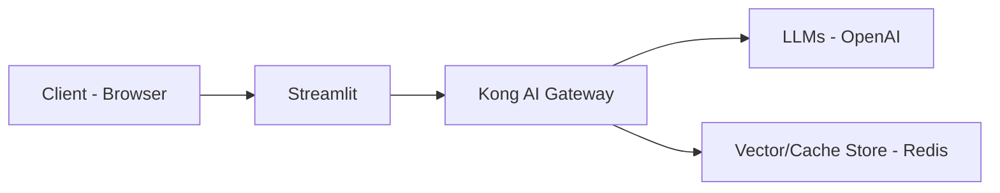

# Konbot - Kong Bot

This is a sample application that demonstrates Kong's AI-related plugins.

## overview



## How to run?

First, set up Kong Gateway and Redis.

```sh
git clone https://github.com/shukawam/kong-plugin-example.git
docker compose -f compose.yaml -f compose-redis.yaml up -d
deck gateway sync plugins/ai/kong.yml
```

After that, run the following scripts to set up vector store.

```sh
# Set up the vector store(using LangChain)
uv run scripts/01_setup_vs.py
# Check the vector search result
uv run scripts/02_retrieve_doc.py
```

Finally, run the following script to start the LLM application.

```sh
streamlit run main.py
```

Then, you can access [http://localhost:8501](http://localhost:8501) via your web browser.
